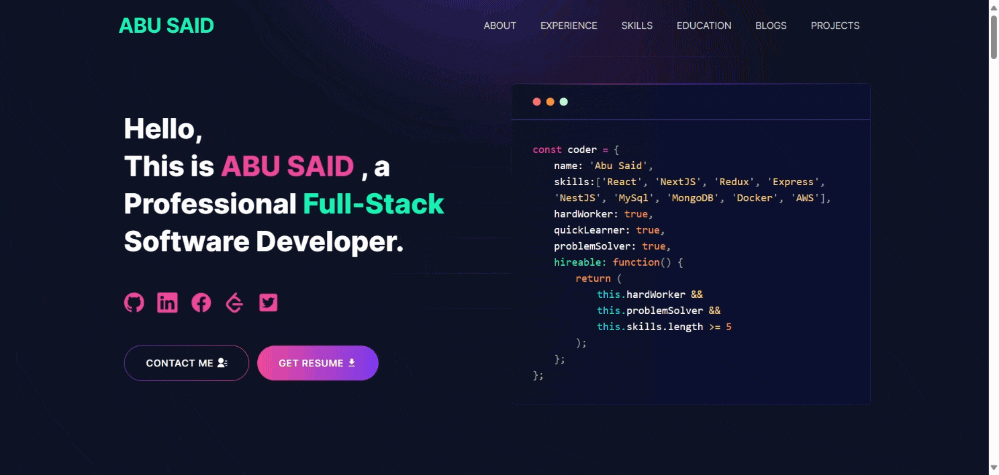

<p align="center">
  
</p>

<h1 align="center">🚀 Hariharan R — Freelancer Portfolio</h1>

<p align="center">
  <b>Graphic Designer • Video Editor • Web Developer</b><br>
  Blending creativity with technology to build digital experiences that feel human, intelligent, and timeless.
</p>

---

## 🌐 Live Preview

👉 **[View My Portfolio](https://hariharan-r-portfolio.vercel.app/)**  
Hosted with ❤️ on [Vercel](https://vercel.com).

---

## 🧩 About This Project

This is my personal **Freelancer Portfolio Website**, designed and developed with modern technologies like **Next.js**, **Tailwind CSS**, and **Framer Motion**.

It showcases my skills in:
- 🎨 Graphic Design (Adobe Illustrator, Photoshop)
- 🎥 Video Editing (Premiere Pro, After Effects)
- 💻 Web Development (React, Next.js, Tailwind, Node.js)

My goal is to create work that’s not just functional, but **aesthetic, fast, and emotionally engaging**.

---

## ⚙️ Tech Stack

| Category | Tools |
|-----------|--------|
| **Frontend** | Next.js, React, Tailwind CSS, Framer Motion |
| **Design** | Adobe Illustrator, Photoshop, After Effects |
| **Development** | Node.js, Git, Vercel |
| **Other** | Lottie Animations, API Integration, Responsive Design |

---

## 📦 Installation & Setup

Clone the repository and install dependencies:

```bash
git clone https://github.com/imhari63/hariharan-portfolio.git
cd hariharan-portfolio
npm install
npm run dev


Now open http://localhost:3000
 in your browser.

🚀 Deployment

This portfolio is deployed automatically using Vercel.
Every time I push updates to the main branch, Vercel rebuilds and updates my live site instantly.

🛠️ Deploy Your Own Version

Fork this repository

Customize data in /utils/data/

Push to your GitHub

Import to Vercel
 → Deploy

📂 Folder Structure
hariharan-portfolio/
├── public/                # Images, videos, and static assets
├── src/
│   ├── components/        # Reusable UI components
│   ├── utils/data/        # Personal and project data files
│   └── app/               # Main Next.js app files
├── package.json
└── README.md

🧠 Featured Projects
Project	Description	Tech
Sribalaji Offset	Modern business website for a printing company with responsive UI and live deployment.	Next.js, Tailwind, Framer Motion
Branding Logo Design	Creative logo and brand identity design focusing on visual storytelling.	Illustrator, Photoshop
Promo Video Editing	Promotional video with motion graphics and cinematic color grading.	Premiere Pro, After Effects
Hariharan Portfolio	This very site — modular, animated, and built from scratch.	Next.js, Framer Motion
Astro AI	AI-powered astrology prediction dashboard with dynamic UI.	Astro, React
💬 Contact Me

Let’s collaborate and bring ideas to life.

📧 Email: yourmail@example.com

🌍 Portfolio: hariharan-r-portfolio.vercel.app

💼 LinkedIn: linkedin.com/in/hariharan-r

📷 Instagram: instagram.com/imhari63

🐙 GitHub: github.com/imhari63

🧠 Personal Philosophy

Rooted in tradition, driven by innovation — I build digital experiences that connect technology with human creativity.

📜 License

This project is open-source and available under the MIT License.
You’re free to use and customize it for your own portfolio with proper credit.

<p align="center">Built with ❤️ by <b>Hariharan R</b> — © 2025</p> ```
✅ What You Should Do Next:

Paste this into your README.md at the root of your repo.

Replace yourmail@example.com with your real email.

Add your LinkedIn and Instagram URLs (if you want them public).

Commit & push:

git add README.md
git commit -m "Added professional README.md"
git push
